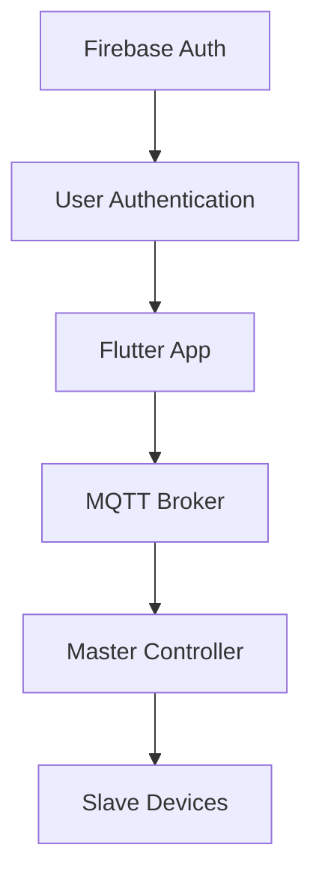
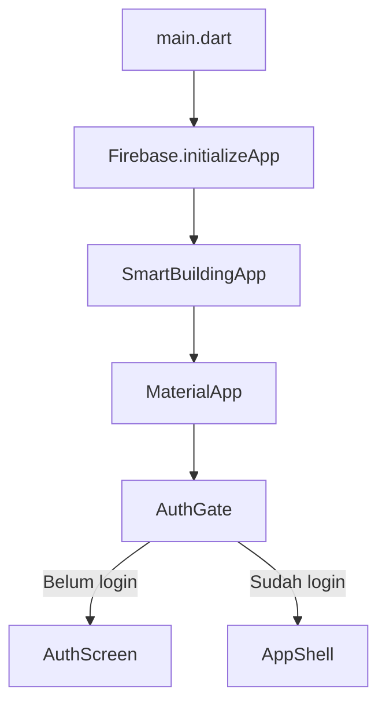
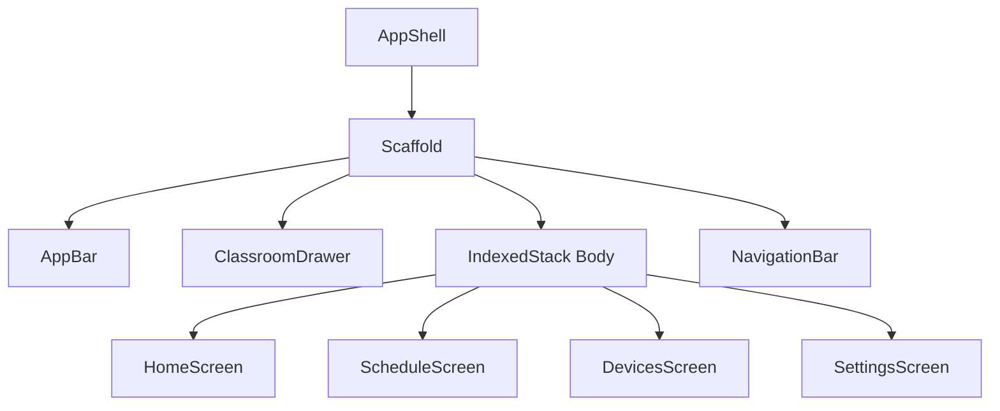
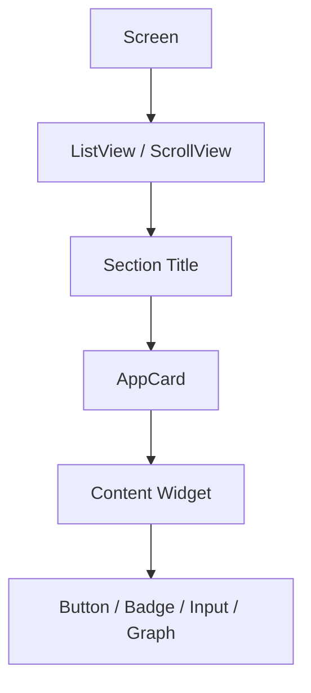
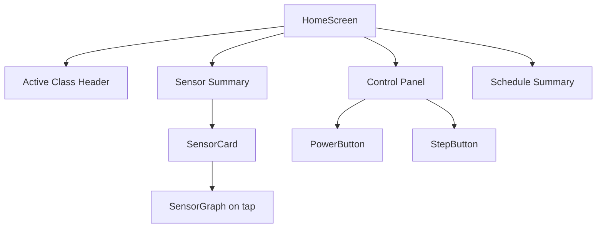
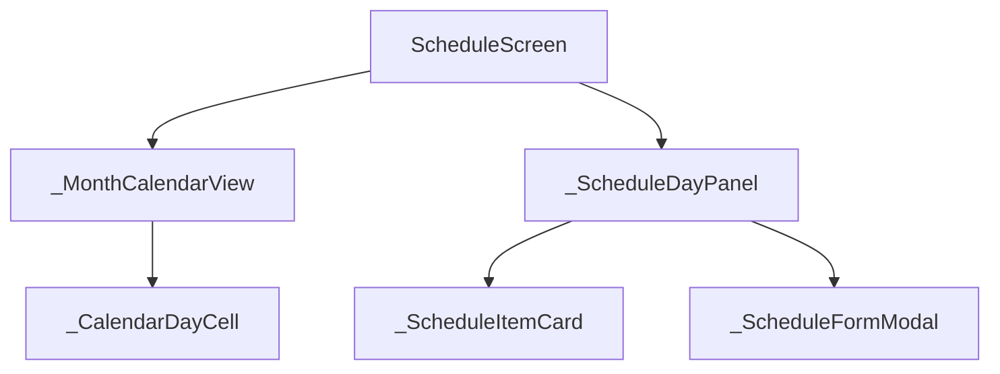
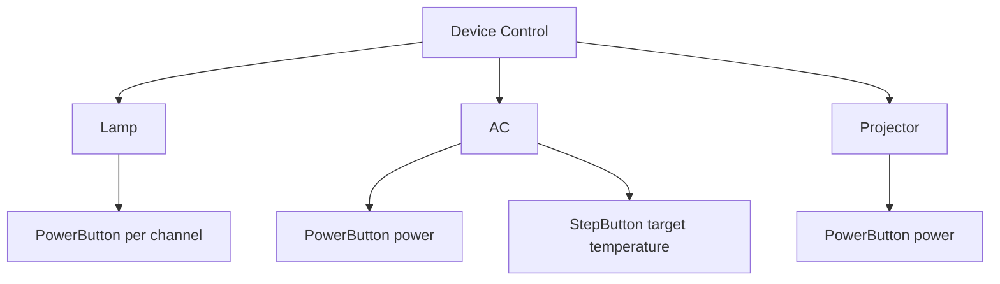
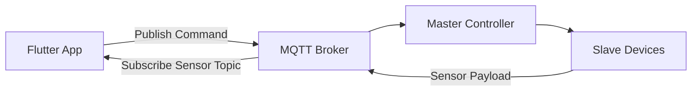

# 🏢 SmartBuilding App V2

Flutter app untuk monitoring, konfigurasi, dan remote control Smart Building berbasis **Firebase Authentication + MQTT**.

Project ini mengikuti dokumen FSD:

📄 `docs/smart_building_app_fsd_v_2_FIXED_schedule.md`

---

## 📌 Ringkasan Cepat

| Area | Teknologi | Fungsi |
|---|---|---|
| UI App | Flutter | Dashboard, schedule, device control, settings |
| Login | Firebase Authentication | Identitas user: sign in, sign up, sign out |
| Realtime Device | MQTT | Monitoring sensor dan kirim command |
| Chart | fl_chart | Grafik sensor |
| Local Storage | shared_preferences | Config lokal app |

Prinsip utama:

```txt
Firebase = siapa pengguna
MQTT      = komunikasi device
Flutter   = UI monitoring dan remote control
Controller= otak Smart Building
```

---

## ✅ Status Implementasi

| Fitur | Status |
|---|---|
| Auth screen satu halaman | ✅ Ada |
| Firebase Auth email/password | ✅ Terhubung |
| Persistent login session | ✅ Via FirebaseAuth authStateChanges |
| Home tab | ✅ Ada |
| Schedule tab | ✅ Ada |
| Devices tab | ✅ Ada |
| Settings tab | ✅ Ada |
| PowerButton untuk device control | ✅ Ada |
| StepButton untuk suhu AC | ✅ Ada |
| Sensor graph | ✅ Ada |
| MQTT service skeleton | ✅ Ada |
| Automation service skeleton | ✅ Ada |

---

## 🧭 Arsitektur Besar



Boundary penting:

```txt
Firebase hanya untuk login user.
MQTT tetap jadi jalur monitoring dan control Smart Building.
```

---

## 🧱 Struktur Folder

```txt
lib/
├── app.dart                 # MaterialApp, AuthGate, AppShell
├── main.dart                # Entry point + Firebase initialize
├── firebase_options.dart    # Generated by FlutterFire CLI
├── models/                  # Data model app
├── screens/                 # Halaman utama app
├── services/                # Firebase Auth, MQTT, storage, automation
├── theme/                   # Color, typography, ThemeData
└── widgets/                 # Widget reusable yang stabil
```

Minimal widget reusable sengaja dibuat kecil:

```txt
lib/widgets/
├── app_button.dart
├── app_card.dart
├── app_badge.dart
├── classroom_drawer.dart
├── power_button.dart
├── sensor_graph.dart
└── step_button.dart
```

Widget kecil yang cuma dipakai di satu screen dibuat sebagai private widget di file screen tersebut.

---

## 🧩 Flow Chart Level Widget

### 1. Level Aplikasi



### 2. Level Scaffold Utama



### 3. Level Container Per Screen



Pattern umum:

```txt
Scaffold
└── ListView / SingleChildScrollView
    └── Section
        └── AppCard
            └── Content
```

### 4. Home Widget Level



### 5. Schedule Widget Level



Schedule widget tidak dipisah jadi banyak file dulu karena masih spesifik untuk satu screen.

### 6. Device Control Level



Rule:

```txt
Switch tidak boleh dipakai untuk Lamp, AC, atau Projector.
Slider tidak dipakai di mana pun.
```

---

## 🔐 Firebase Authentication

Firebase dipakai hanya untuk identitas user.

Supported V1:

```txt
Email + Password
Sign In
Sign Up
Sign Out
Persistent Login Session
```

Tidak termasuk V1:

```txt
Google Sign In
Microsoft Login
Phone Login
Anonymous Login
SSO
Multi-Factor Authentication
```

File terkait:

| File | Fungsi |
|---|---|
| `lib/main.dart` | Initialize Firebase |
| `lib/firebase_options.dart` | Config Firebase generated |
| `lib/services/auth_service.dart` | FirebaseAuth sign in/up/out |
| `lib/screens/auth_screen.dart` | UI login/register satu screen |
| `android/app/google-services.json` | Config Firebase Android |

Checklist Firebase Console:

```txt
Authentication
└── Sign-in method
    └── Email/Password = Enabled
```

---

## 📡 MQTT Direction

MQTT adalah jalur utama Smart Building.



Topic tidak hardcoded per room.

Rule:

```txt
className adalah source of truth.
Topic dibuat dari TopicGenerator / ClassTopics.
```

Format topic:

```txt
Class <className> <data_type>
```

Contoh:

```txt
Class A101 suhu
Class A101 co2
Class A101 lux
Class A101 presence
Class A101 led
Class A101 ac
Class A101 projector
```

---

## 📅 Schedule & Automation

Schedule adalah tab utama, bukan bagian dari Devices.

Automation direction:

```txt
15 menit sebelum kelas mulai
└── Pre-start automation

Saat kelas selesai
└── Cek presence
    ├── Kosong    -> shutdown
    ├── Masih ada -> waiting empty, recheck tiap 5 menit
    └── Stale/null -> pause, jangan shutdown
```

Rule penting:

```txt
Auto shutdown tidak boleh jalan jika presence stale atau unavailable.
Automation tidak boleh spam command jika state device sudah sama.
Auto projector ON default adalah false.
```

---

## 🎨 Theme

Theme token ada di:

```txt
lib/theme/app_colors.dart
lib/theme/app_text_styles.dart
lib/theme/app_theme.dart
```

Semua screen dan widget reusable harus pakai token dari theme, bukan warna bebas.

---

## 📖 Cara Baca dan Memahami FSD

FSD dibaca dari besar ke kecil.

### 1. Mulai dari tujuan app

Baca:

```txt
# 1. App Requirement Alignment
# 7. App Structure Draft
# 8. Architecture Direction
```

Tujuannya untuk paham:

```txt
App ini buat apa?
User masuk dari mana?
Main tab apa saja?
```

### 2. Lanjut ke aturan UI

Baca:

```txt
# 2. Flutter Widget Usage Summary
# 3. Reusable Widget Mapping
# 4. Widget Simplification Rules
# 5. Color Palette
# 6. Font Template
```

Tujuannya untuk paham:

```txt
Widget apa yang boleh dipakai?
Kapan bikin file widget baru?
Style warna dan text seperti apa?
```

### 3. Lanjut ke data dan komunikasi

Baca:

```txt
# 9. Data Model Direction
# 10. MQTT UX Flow
# 13. Class/Room Selection And Auto Topic Generation
```

Tujuannya untuk paham:

```txt
Data model apa saja?
MQTT topic dibentuk dari mana?
Apa yang disimpan lokal dan apa yang computed?
```

### 4. Lanjut ke feature utama

Baca:

```txt
# 14. Auth Requirement
# 15. Schedule And Automation Requirement
# 17. Firebase Authentication Requirement
```

Tujuannya untuk paham:

```txt
Login flow seperti apa?
Schedule ditaruh di mana?
Automation boleh dan tidak boleh melakukan apa?
Firebase batasnya sampai mana?
```

### 5. Tutup dengan guardrails

Baca:

```txt
# 16. Final Implementation Guardrails For Codex/Agent
```

Bagian ini adalah daftar larangan dan aturan final yang harus dicek sebelum coding dianggap selesai.

---

## 🧪 Cara Menjalankan Project

Install dependencies:

```bash
flutter pub get
```

Jalankan analyzer:

```bash
flutter analyze
```

Jalankan test:

```bash
flutter test
```

Run Android:

```bash
flutter run -d emulator-5554
```

Run dengan device pilihan:

```bash
flutter devices
flutter run -d <device-id>
```

---

## 🔧 Setup Firebase Lokal

Login Firebase CLI:

```bash
firebase login
```

Configure FlutterFire:

```bash
flutterfire configure --project=<firebase-project-id> --platforms=android
```

Project saat ini sudah dikonfigurasi ke:

```txt
Firebase Project ID: smart-building-c39f7
Android Package:     com.example.smart_building_app
```

---

## 🧹 Project Rules

```txt
✅ Pakai satu AuthScreen untuk Sign In dan Sign Up.
✅ Pakai PowerButton untuk Lamp, AC, Projector.
✅ Pakai StepButton untuk suhu AC.
✅ Topic MQTT harus generated dari className.
✅ Schedule adalah main tab.
✅ Debug hanya di Devices > Advanced.
✅ Firebase hanya untuk login.

❌ Jangan buat SignInScreen dan SignUpScreen terpisah.
❌ Jangan pakai Switch untuk device power.
❌ Jangan pakai Slider.
❌ Jangan hardcode topic per classroom.
❌ Jangan simpan ClassTopics ke storage.
❌ Jangan pakai Firebase untuk device control.
```

---

## 🗺️ Roadmap V1

| Prioritas | Item |
|---|---|
| P0 | Firebase Auth email/password |
| P0 | MQTT connect/subscribe/publish real |
| P1 | Storage config classroom dan schedule |
| P1 | Live sensor update dari MQTT |
| P1 | Control command payload real |
| P2 | Automation runtime lengkap |
| P2 | Better debug panel |
| Future | Firestore sync, role management, activity logs |

---

## 📝 Catatan Developer

Setiap file Flutter project ini mengikuti format komentar:

```dart
// EDIT_TARGET: <file>
// EDIT_PURPOSE: <fungsi file>
// EDIT_REASON: <alasan file dibutuhkan>
```

Tujuannya supaya perubahan tetap mudah diaudit terhadap FSD.
