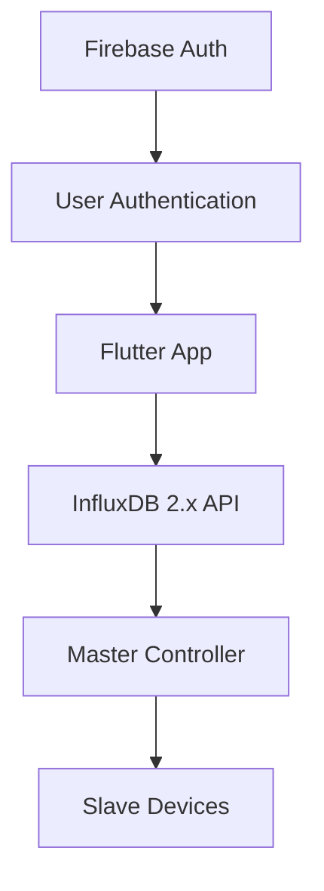
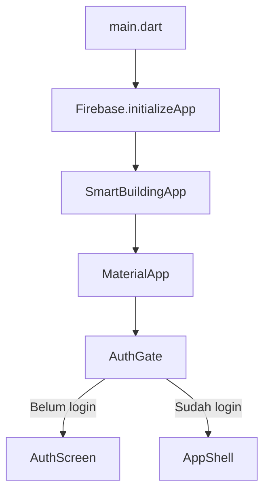
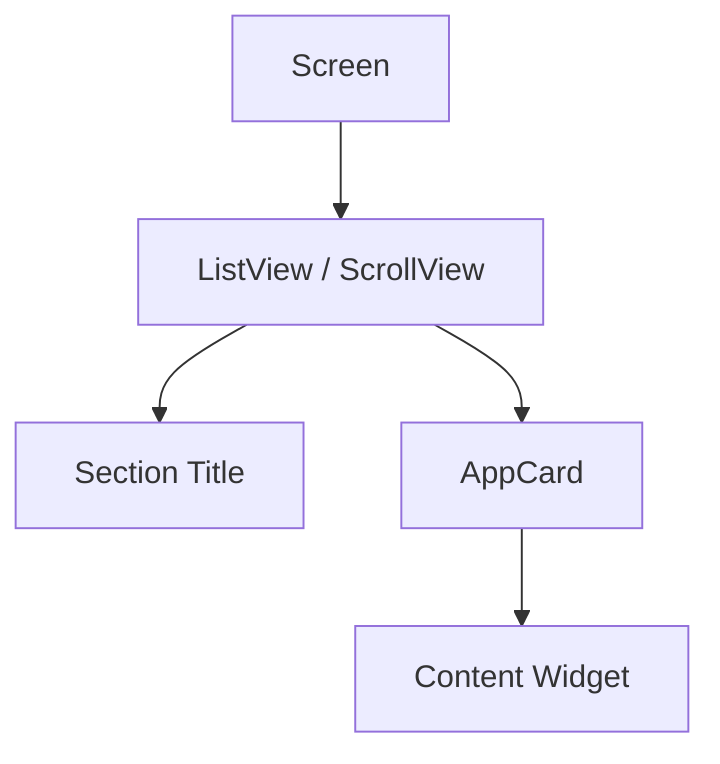
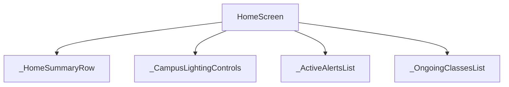
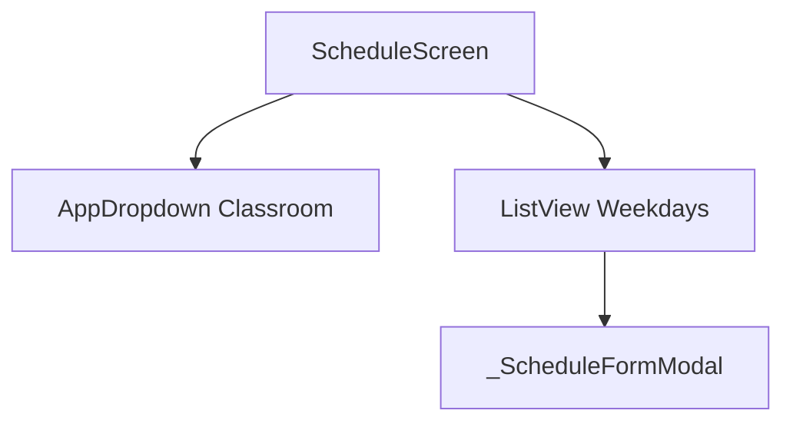
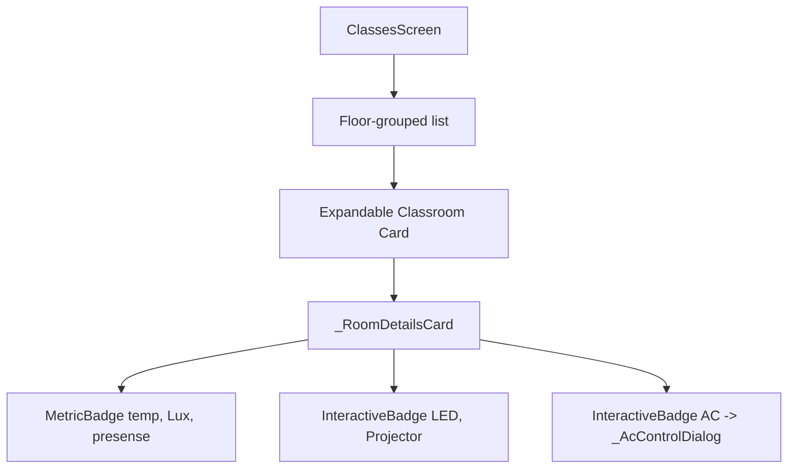

# 🏢 SmartBuilding App V2

Flutter app untuk monitoring, konfigurasi, dan remote control Smart Building berbasis **Firebase Authentication + InfluxDB 2.x**.

Project ini mengikuti dokumen FSD:

📄 `docs/smart_building_app_fsd_v_2_FIXED_schedule.md`

---

## 📌 Ringkasan Cepat

| Area | Teknologi | Fungsi |
|---|---|---|
| UI App | Flutter | Dashboard, schedule, device control, settings |
| Login | Firebase Authentication | Identitas user: sign in, sign out (sign up dinonaktifkan) |
| Realtime Device | InfluxDB 2.x API | Monitoring sensor via Query API dan kirim command via Write API |

Prinsip utama:

```txt
Firebase = siapa pengguna (user authentication)
InfluxDB = database dan jalur komunikasi command & status
Flutter  = UI monitoring dan remote control
Controller = otak Smart Building (mengambil status & command dari database)
```

---

## ✅ Status Implementasi

| Fitur | Status |
|---|---|
| Auth screen satu halaman | ✅ Ada (Sign In saja, Sign Up dinonaktifkan) |
| Firebase Auth email/password | ✅ Terhubung |
| Persistent login session | ✅ Via FirebaseAuth authStateChanges |
| Home tab (Building Overview) | ✅ Ada |
| Schedule tab (Database Schedule) | ✅ Ada (Menggunakan bitmask & case-insensitive matching) |
| Classes tab (Classrooms List) | ✅ Ada (Tapping card untuk expand details & control panel) |
| Settings tab | ✅ Ada (Sign Out) |
| AC Control Dialog | ✅ Ada (Menggunakan Switch power, Slider suhu, Dropdown fan speed) |
| Slasheless AC Code | ✅ Ada (Mengirim format 8-digit `ppttffss` ke InfluxDB) |
| InfluxDB 2.x API Integration | ✅ Ada (OR-based Flux query untuk query sensor & status) |

---

## 🧭 Arsitektur Besar



Boundary penting:

```txt
Firebase hanya untuk login user.
InfluxDB 2.x API digunakan sebagai single source of truth untuk monitoring status sensor dan pengiriman perintah remote control.
```

---

## 🧱 Struktur Folder

```txt
lib/
├── app.dart                 # MaterialApp, AuthGate, AppShell
├── main.dart                # Entry point + Firebase initialize
├── firebase_options.dart    # Generated by FlutterFire CLI
├── models/                  # Data model app (ClassRoomConfig, InfluxRoomData)
├── screens/                 # Halaman utama app (Home, Schedule, Classes, Settings)
├── services/                # Firebase Auth, InfluxDB API sync
├── theme/                   # Color, typography, ThemeData
└── widgets/                 # Widget reusable yang stabil
```

---

## 🧩 Flow Chart Level Widget

### 1. Level Aplikasi



### 2. Level Scaffold Utama

```mermaid
flowchart TD
    A[AppShell] --> B[Scaffold]
    B --> C[AppBar]
    B --> E[IndexedStack Body]
    B --> F[NavigationBar]

    E --> G[HomeScreen]
    E --> H[ScheduleScreen]
    E --> I[DevicesScreen] (ClassesScreen)
    E --> J[SettingsScreen]
```

### 3. Level Container Per Screen



### 4. Home Widget Level



### 5. Schedule Widget Level



### 6. Device & Sensor Control Level (Classes tab)



---

## 📅 Schedule

Schedule adalah tab utama untuk mengkonfigurasi waktu belajar mengajar kelas secara mingguan. Jadwal mingguan disinkronkan langsung ke pengukuran `classroom_schedule` di InfluxDB menggunakan kode bitmask 6-sesi.


---

## 🎨 Theme

Theme token ada di:

```txt
lib/theme/app_colors.dart
lib/theme/app_text_styles.dart
lib/theme/app_theme.dart
```

Semua screen dan widget reusable harus pakai token dari theme untuk konsistensi UI.

---

## 🧪 Cara Menjalankan Project

Install dependencies:

```bash
flutter pub get
```

Jalankan analyzer:

```bash
flutter analyze
```

Jalankan test:

```bash
flutter test
```

---

## 🔧 Setup Firebase Lokal

Login Firebase CLI:

```bash
firebase login
```

Configure FlutterFire:

```bash
flutterfire configure --project=<firebase-project-id> --platforms=android
```

---

## 🧹 Project Rules

```txt
✅ Pakai satu AuthScreen untuk Sign In (Sign Up dinonaktifkan).
✅ Pakai InfluxDB 2.x HTTP Write/Query API untuk sensor & actuator.
✅ Pakai Switch, Slider, dan Dropdown hanya di dalam dialog AC (_AcControlDialog).
✅ Kirim AC command tanpa garis miring (Format 8-digit ppttffss).
✅ Deteksi nilai sensor stale -1 dan tampilkan sebagai "-" di UI.
✅ Cek schedule day case-insensitively saat mencocokkan field dari database.
✅ Schedule adalah main tab.
```
